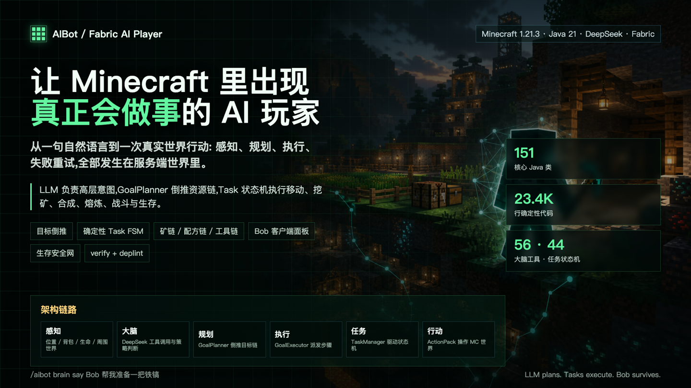
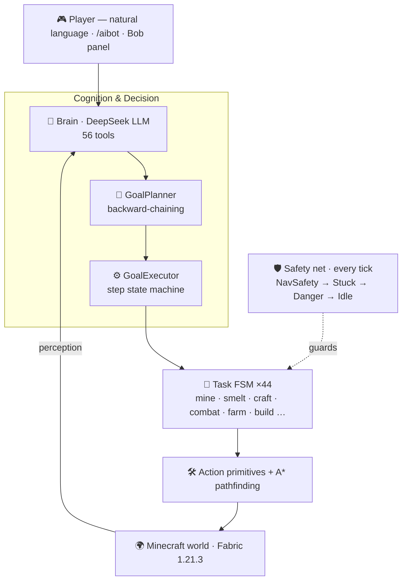

<p align="center">
  
</p>

<h1 align="center">AIBot</h1>

<p align="center">
  <b>An autonomous Minecraft AI player.</b><br>
  Tell it once, in plain language — it figures out the rest.
</p>

<p align="center">
  <a href="LICENSE"></a>
  
  
  
  
  
</p>

<p align="center">
  <b>English</b>&nbsp;·&nbsp;<a href="README.zh-CN.md">简体中文</a>
</p>

---

> **LLM plans. Tasks execute. Bob survives.**
>
> AIBot spawns a real server-side player that perceives the world, back-chains your goal into a complete plan, and carries it out on its own — mining, fighting, farming, surviving.

## ✨ Why AIBot

Most "AI in games" demos either let a language model hallucinate raw actions, or hard-code a rigid script. AIBot does neither — it splits the brain in two:

- 🧠 **The LLM understands intent.** You say *"mine 3 diamonds"*; DeepSeek interprets it and picks from **56 tools**.
- ⚙️ **A deterministic engine guarantees execution.** A backward-chaining planner expands that goal into a dependency-correct plan, **44 self-contained task state machines** run it reliably, and a **five-layer safety net** keeps the bot alive.

The result is an agent that is **flexible enough to take orders in natural language, yet robust enough to actually finish the job.**

## 🎬 See it in action

```
/aibot brain say Bob mine 3 diamonds
```

AIBot back-chains the goal into a full plan and executes it step by step:

```
chop oak → crafting table → wooden pickaxe → mine stone → stone pickaxe
→ descend to Y16 → mine iron → smelt → iron pickaxe → gear up
→ staircase down to Y-59 → ⛏  mine diamonds  ✓
```

You never hand it a step list. If a step fails, it **re-plans**. If it's drowning or under attack, it **bails out and survives**.

## 🧩 Features

| | |
|---|---|
| 🗣️ **Natural-language control** | Plain English / Chinese commands, understood by a DeepSeek LLM wired to 56 tools. |
| 🎯 **Goal back-chaining** | One goal → a dependency-correct multi-step plan. No manual breakdown. |
| 🧩 **LLM + deterministic hybrid** | The model reasons; the engine executes. Flexible *and* reliable. |
| 🛡️ **Five-layer safety net** | Drowning, lava, suffocation, stuck, threats, dark-traps — handled every tick. |
| 🧍 **Human-like behavior** | Staircase mining (never straight down), no teleporting, no bunny-hopping. |
| ⛏️ **Full survival loop** | Mine, smelt, craft, fight, hunt, farm, breed, build, fish, trade, sleep. |
| 🔭 **Ore & tree prospecting** | Palette-level long-range scan locates resources and paths to them. |
| 🖥️ **Client control panel** | `Alt + 0` opens Bob's panel: health, hunger, task, tokens, inventory, chat. |

## 🏗️ Architecture

> **One principle: the LLM plans, deterministic tasks execute.**



<p align="center"><sub><b>151</b> classes · <b>23.4K</b> LOC · <b>56</b> tools · <b>44</b> task state machines · <b>5</b>-layer safety net</sub></p>

## 🚀 Quick Start

### Requirements

| Component | Version |
|---|---|
| Minecraft | `1.21.3` |
| Fabric Loader | `0.18.4+` |
| Fabric API | `0.114.1+1.21.3` |
| Yarn Mappings | `1.21.3+build.2` |
| Java | `21` |

### Build & run

```bash
git clone https://github.com/zoyluoblue/mc_aiplayer.git
cd mc_aiplayer

./gradlew build        # build the mod
./gradlew runServer    # dev server
./gradlew runClient    # dev client
```

### Configure the LLM

Provide your DeepSeek API key via environment variable (recommended):

```bash
export DEEPSEEK_API_KEY="sk-your-key"
```

On first run the mod writes `aibot.json` to the Fabric config directory. You can also set the key, base URL and model there:

```json
{
  "deepseek": { "baseUrl": "https://api.deepseek.com", "model": "deepseek-chat" }
}
```

> Any OpenAI-compatible endpoint works — just point `baseUrl` at your provider.

## 🎮 Usage

```mcfunction
/aibot spawn Bob                              # spawn an AI player
/aibot list                                   # list active bots
/aibot brain say Bob mine 3 diamonds          # natural-language goal
/aibot task assign Bob mine minecraft:stone 16
/aibot task status Bob                         # inspect / abort a task
/aibot brain status Bob
```

Press **`Alt + 0`** in-game to open the **Bob control panel** — track health, hunger, task, brain state, token usage and inventory, and send natural-language messages directly.

## 🧠 How it works

| Layer | Package | Role |
|---|---|---|
| **Brain** | `brain` | DeepSeek tool-calling loop; turns intent into goals & actions |
| **Goal engine** | `goal` | `Goal` → `GoalPlanner` (back-chaining) → `GoalExecutor` (FSM) |
| **Tasks** | `task` | 44 self-contained state machines, each with its own watchdog |
| **Action / Pathfinding** | `action` · `pathfinding` | `BlockMiner`, `DigNav`, `ActionPack`; A* with stand-ability checks |
| **Knowledge** | `craft` · `mining` | recipes, mining/smelt chains, tool tiers, ore & tree prospector |
| **Safety net** | `task` · `coordination` | `BotTickCoordinator`: NavSafety → Stuck → Danger → Goal → Idle |
| **Entity** | `entity` | `AIPlayerEntity` — a real server-side fake player |

## 📦 Project structure

```text
src/main/java/io/github/zoyluo/aibot
├── action/        # low-level: move, mine, interact, inventory, build
├── brain/         # LLM requests, tool registry, decision coordination
├── command/       # /aibot commands
├── coordination/  # multi-bot task board & idle coordination
├── craft/         # recipes & crafting helpers
├── entity/        # the AI player entity
├── goal/          # declarative goals, planner, executor
├── mining/        # ore scan & long-range prospector
├── pathfinding/   # A* pathfinding & danger checks
├── task/          # deterministic task state machines + safety net
└── …              # log · memory · network · observe · persist · mixin
```

## 🛠️ Tech stack

**Java 21** · **Fabric** (Loader 0.18.4, API 0.114.1+1.21.3) · **Yarn** 1.21.3+build.2 · **Gradle** · **DeepSeek** (OpenAI-compatible API).

## 🗺️ Roadmap

- [ ] Zero-to-hero survival loop hardening
- [ ] Multi-bot collaboration
- [ ] Richer client interaction
- [ ] Long-term memory recovery
- [ ] Automated verification scenarios (`/aibot verify`, `/aibot deplint`)

## 🤝 Contributing

Issues and PRs are welcome! When touching Minecraft / Fabric API code, mind version compatibility — this project pins **Yarn 1.21.3+build.2**. Verify method signatures before changing item components, eating, fuel registration, mining speed, furnace inventory, or client networking.

```bash
./gradlew clean build   # please make sure this passes before opening a PR
```

## 📜 License

Released under the [MIT License](LICENSE). © 2026 zoyluo.

## 🙏 Acknowledgements

Built on [Fabric](https://fabricmc.net/). Natural-language reasoning powered by [DeepSeek](https://www.deepseek.com/). Inspired by the Carpet-mod fake-player tradition.

---

<p align="center"><sub><b>LLM plans · Tasks execute · Bob survives</b></sub></p>
